# Oliver Lin

> 15-year-old open source contributor from China 🇨🇳

Building with Linux, TypeScript, AI and infrastructure.

<p align="center">
  
</p>



## About Me

- 🐧 Linux enthusiast
- ⚡ Full-stack developer
- 🛠 Open source contributor
- 🤖 Exploring LLMs and AI infra
- 🌏 Based in Guangdong, China

## Open Source

- Contributor to [win12-online/win12](https://github.com/win12-online/win12)
- Contributor to [fastfetch](https://github.com/fastfetch-cli/fastfetch)
- Active on GitHub OSS projects

## Tech Stack

```bash
OS        Ubuntu 26.04 / KDE / GNOME
Editor    VS Code
Shell     zsh + starship
Languages TypeScript / Python / C++
Infra     Docker / Cloudflare / Linux
```

## Featured Projects

### OliveAI(WIP)
Local LLM fine-tuning experiments using Qwen and LoRA.

### Chinese-law
Chinese law related website powered by Next.js edge runtime.

## GitHub Stats

|  |  |
| :- | :- |

## Contact

- Website: https://liuxiaozhen.dev
- Telegram: https://t.me/liuxiaozhen
- Email: oliver@liuxiaozhen.dev
